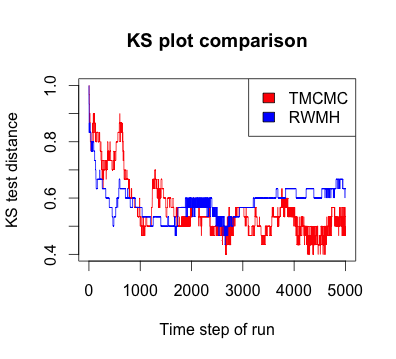
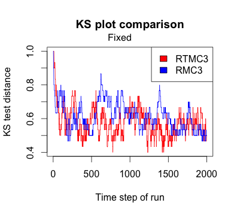

## Overview of tmcmcR

Transformation based Markov Chain Monte Carlo (TMCMC) is a modification of standard Random Walk Metropolis Hastings (RWMH), which is the simplest and still the most widely used MCMC mechanism. TMCMC  is computationally fast and  has better acceptance rate and better coverage of the state space, specially in high dimensions, compared to RWMH. See [Dutta and Bhattacharya 2014](http://www.sciencedirect.com/science/article/pii/S1572312713000683) and  [Dey and Bhattacharya 2015](http://imstat.org/bjps/papers/BJPS295.pdf) for the algorithm and theoretical properties of TMCMC. In this package **tmcmcR**, we implement the Rcpp versions of RWMH and TMCMC, along with several adaptive versions of the TMCMC algorithm  and metropolis coupled approaches applicable for simulating from multimodal target densities.

To install the **tmcmcR** package, 

```{r install_package, results='hide', message = FALSE, warning = FALSE}
library(devtools)
install_github('kkdey/tmcmcR')
```

To load the package,

```{r load_package,  message = FALSE, warning = FALSE}
library(tmcmcR)
```

## Arguments Format

As of version 0.0.1, the arguments to the tmcmcR functions are pretty generic. All the sampling functions in the package take a `target_pdf` model which is a statistical model density, specified as a function of the parameters, on which we want to run the sampling mechanism. The user should transform the parameters such that they are unconstrained and the state space spans $\mathbb{R}^{d}$ for $d$ many parameters. Often the target pdf is easier to specify under naturally constarined parameters, for instance the simplex variables. In such a case, the user must have the unconstrained parameters as arguments to ` target_pdf` and must include the transformations inside the `target_pdf` function.

All the sampling schemes take a `base` input which is the starting value of the chain. The default is all zeros. However, if the user has prior information about the concentration of the `target_pdf`, it is better to provide a `base` that is close to the region of high concentration for faster convergence to the target. 

The other common feature in all functions is the argument `nsamples` which represents the total number of samples we generate for the chain. The burn in is assumed to be $\frac{1}{3}$ rd of the `nsamples`. 

## Illustration

### The model

We present an illustration of the different sampling schemes in **tmcmcR**. We assume a model from which we want to simulate. Assume the simulation model (an example model taken from Mattingly et al.)

```{r echo=TRUE, eval=TRUE}
d=50;  ##  dimension of the simulated variable

mu_target=rep(0,d);
Sigma_target = 0.01*diag(1/(1:(d))*d);

Mattingly_matrix <- 100*(diag(1-0.7,d)+0.7*rep(1,d)%*%t(rep(1,d)));

library(mvtnorm)

pdf = function(x)
{
  return (dmvnorm(x,mu_target,Sigma_target,log=TRUE)-t(x)%*%Mattingly_matrix%*%x)
}
```

### RWMH and TMCMC

We simulate the RWMH and the TMCMC chains for the model above.

We choose our starting point or `base` to be independently drawn $N(0,1)$ random variables for each co-ordinate.

```{r echo=TRUE, eval=TRUE}
base=rnorm(d,0,1); ## the starting point generated independently from N(0,1)
```

For running the general RWMH chain, use the `rwmh_metrop` function.

```{r echo=TRUE, eval=TRUE}
system.time(out_rwmh <- rwmh_metrop(pdf,base=base, scale=1,nsamples=5000, verb=FALSE))
```

To run the TMCMC chain, use the `tmcmc_metrop` function.

```{r echo=TRUE, eval=TRUE}
system.time(out_tmcmc <- tmcmc_metrop(pdf,base=base, scale=1,nsamples=5000, verb=FALSE))
```

### Adaptive version

For the general RWMH and TMCMC chains, the user is required to provide the proposal `scale` and the performance of the chain depends on the choice of the `scale`. Check [Dey and Bhattacharya 2015](http://arxiv.org/abs/1307.1446) for the choice of optimal scales for the TMCMC chain. However, fixing the scale for very complicated models may be tricky. The user can get around this problem by opting for adaptive version of the above chains. The function `adapt_tmcmc_metrop.R` fits adaptive TMCMC chains. The user can choose one of 3 adaptive schemes - Atchade method, Haario method and RAMA. For theoretical details on these methods, check [Roberts and Rosenthal 2008](http://probability.ca/jeff/ftpdir/adaptex.pdf), [Haario et al 2005](http://link.springer.com/article/10.1007%2FBF02789703), [Atchade and Rosenthal 2005](https://projecteuclid.org/euclid.bj/1130077595).

#### RWMH adaptive versions

```{r echo=TRUE, eval=TRUE}
system.time(out_adapt_rwmh <- adapt_rwmh_metrop(pdf,base=base, nsamples=5000, 
                                                  method="Atchade", verb=FALSE));

system.time(out_adapt_rwmh <- adapt_rwmh_metrop(pdf,base=base, nsamples=5000, 
                                                  method="SCAM", verb=FALSE));

system.time(out_adapt_rwmh <- adapt_rwmh_metrop(pdf,base=base, nsamples=5000, verb=FALSE,
                                      a_rama = 1, b_rama=1, M_rama=100, method="Rama"));

```

#### TMCMC adaptive versions

```{r echo=TRUE, eval=TRUE}
system.time(out_adapt_tmcmc <- adapt_tmcmc_metrop(pdf,base=base, nsamples=5000, 
                                                  method="Atchade", verb=FALSE));

system.time(out_adapt_tmcmc <- adapt_tmcmc_metrop(pdf,base=base, nsamples=5000, 
                                                  method="SCAM", verb=FALSE));

system.time(out_adapt_tmcmc <- adapt_tmcmc_metrop(pdf,base=base, nsamples=5000, verb=FALSE,
                                      a_rama = 1, b_rama=1, M_rama=100, method="Rama"));

```

If the argument `verb` is TRUE, the function will output the progress of the simulation (how many runs of the samples have been completed). Also for the RAMA method, there are additional parameters `a_rama`, `b_rama` and `M_rama`. If these values are not provided by the user, the default value assumed are `a_rama =0`, `b_rama =0` and `M_rama =100`. 

### Metropolis coupling

The usual RWMH or TMCMC chains do not perform well on multimodal densities and have a tendency to get stuck at one of the modes. Metropolis coupling is a popular technique used to get around this problem. One runs multiple chains on the model density $f(x)^{\beta}$ for different choices of $\beta$ ranging from $1$ to $\beta_{min}$, where the latter is a value close to $0$. To choose the $\beta$ values (also called inverse temperatures), one can use two types of stepsize selection approach - fixed or randomized. The selection of inverse temperatures for the fixed approach in MC3 is similar to the approach suggested in [Atchade, Roberts and Rosenthal 2010](http://link.springer.com/article/10.1007%2Fs11222-010-9192-1). We generalized this approach for the randomized version and also extended it to transformation based chains. 

```{r echo=TRUE, eval=FALSE}

inverse_temp <- select_inverse_temp(pdf_component, minbeta=0.05, L_iter =50, 
                                    sim_method="TMCMC",inv_temp_scheme = "randomized")

```

The above function would fix the inverse temperatures for the RTMC3 chain.
The user may choose the `sim_method` to be RWMH for RMC3 chain. Correspondingly, fixing the `inv_temp_scheme` to be \textbf{fixed} would generate the inverse temperatures for the MC3 and TMC3 chains.

For RTMC3, one can define the `beta_set` to be the output array of inverse temperatures selected above.

```{r echo=TRUE, eval=FALSE}

base=rnorm(d,0,1); ## the starting point generated independently from N(0,1)
out_rtmc3 <- rtmc3(pdf, beta_set = inverse_temp, scale=1, base=base, cycle=10, nsamples=5000, verb=FALSE)

```

## Performance illustration

We first compare the performance of the TMCMC chain and the RWMH chain in terms of convergence to the test distribution. We ran $50$ chains of TMCMC and RWMH for the model specified above for $nsamples = 5000$ and then compared the empirical distribution of the two chains at each time with the target density. We present the plots for two arbitrary co-ordinates.




Next we compare the performances of the adaptive versions of RWMH against the test distribution and see how the three adaptive methods - due to Atchade, SCAM and the RAMA methods perform in comparison to each other. We plot for two randomly selected co-ordinates.


We do the same for the TMCMC adaptive versions.


Finally we present the same KS-comparison for the first co-ordinate of the principal chain (inverse temperature equal to 1) after 2000 iterations of RMC3 and RTMC3 procedures, with and without randomization in choosing the set of inverse temperatures.





### Acknowledgements

- Gao Wang, Stephens Lab, University of Chicago
- Nan Xiao, Stephens Lab, University of Chicago


